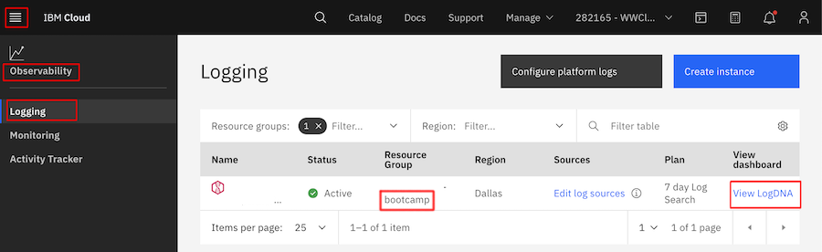
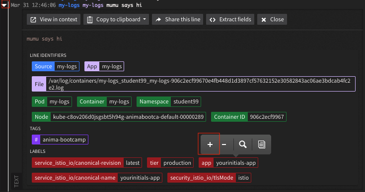
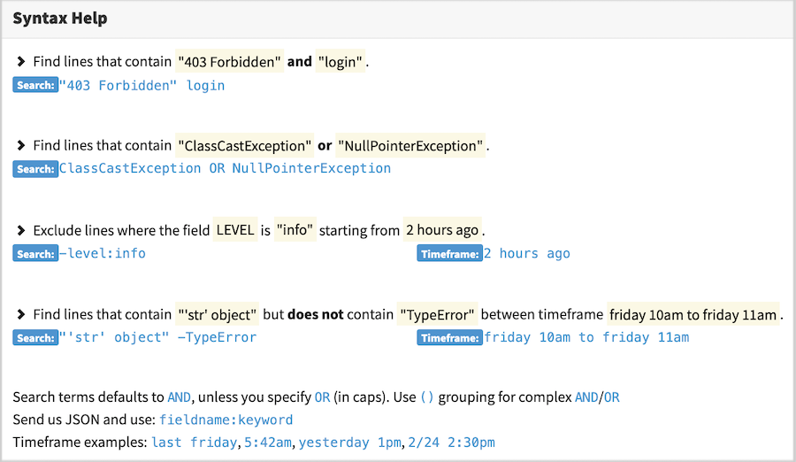
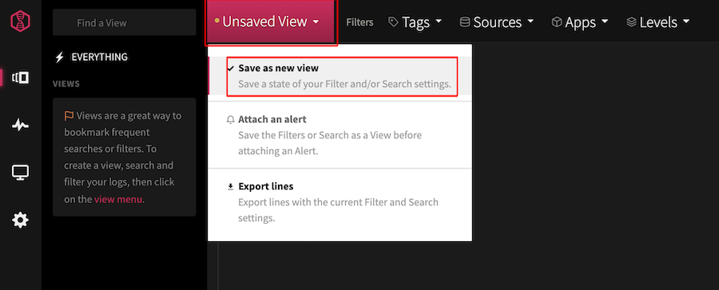
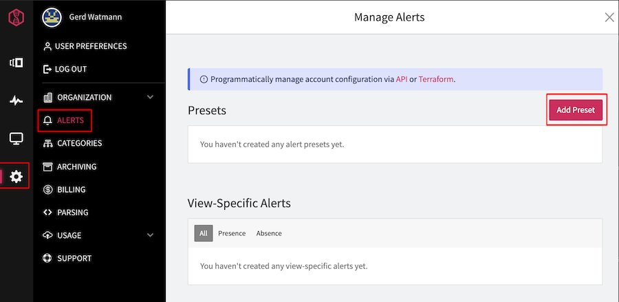
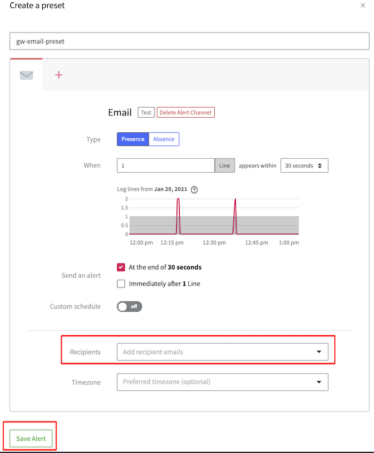
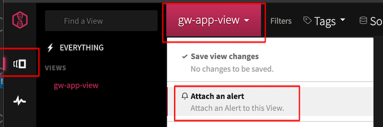

# Lab 10: Using LogDNA for Kubernetes Cluster Logging

## Prerequisites

- Connected to IBM Kubernetes cluster with attached LogDNA agent
- Assumption here is that most of you will use IBM Cloud Shell (due to networking and local tools)
- Make sure everytime you create resources that you target the right Kubernetes cluster and namespace

```bash
ibmcloud ks cluster config --cluster **kubeclusterid**
kubectl config set-context --current --namespace=student**yourinitials**
```

## Supporting Information

<https://cloudnative101.dev/electives/logging/logdna/> (video gives great overview)

<https://cloudnative101.dev/electives/logging/logdna/activities/dashboards/>
<https://docs.logdna.com/docs/filters>
<https://docs.logdna.com/docs/search>

## Challenges to be solved

### Create test deployment producing load

Create the following test pod to produce log statements.

```bash
$ kubectl run my-logs \
 --rm -it \
 -l "app=yourinitials-app,tier=production" \
 --image=busybox \
 -- sh

If you do not see a command prompt, try pressing enter.
/ # echo "YOUR-INITIALS says hello!"
```

1. Fire a few additional `echo "your choice what to log"` commands to produce additional log entries.

### Use the LogDNA Dashboard to find your logs

1. Startup the shared LogDNA dashboard that can be found in **Navigation Menu** -> **Observability** -> **Logging** .
   

1. Find your log statements in the LogDNA dashboard by just leveraging the search field

1. Additionally add a filter with the label.app attribute. It can be very easily added by just selecting a row, selecting the field you want to add to your filter and press the "+" button.
   


1. Experiment with AND and OR operations, attached infos from the syntax help.
   

### Create a view based on your current query

1. Create a LogDNA view called 'yourinitials-app-view'. By doing so you save your current search configuration into a persistent view.
   

### Create an alert based on your view

1. Create an Alert Preset called 'yourinitals-email-preset'.
   
1. Work with the default settings, just add your email address.
   
1. Attach this email preset to your view as an alert.
   

1. Create additional log entries

## Verification

You should receive alert emails from LogDNA. Don't forget to detach the alert after your tests.
