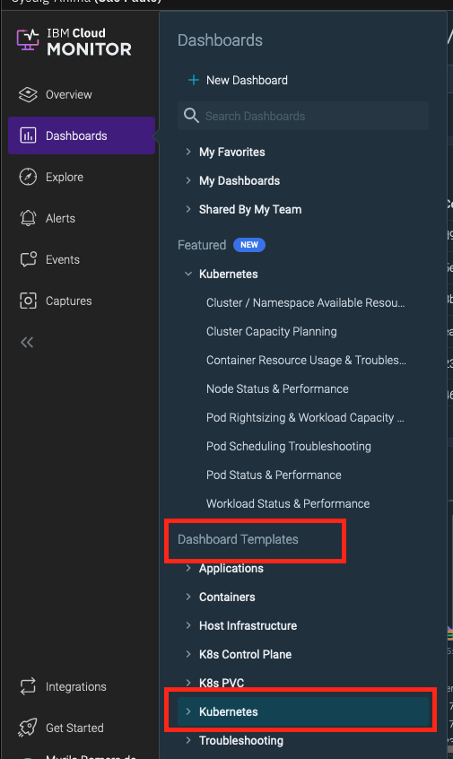
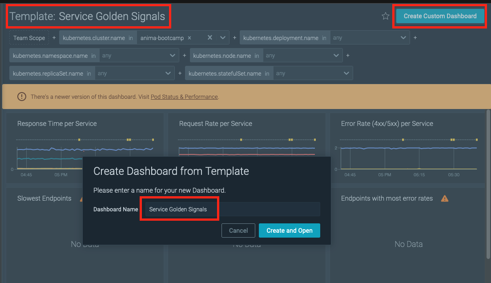
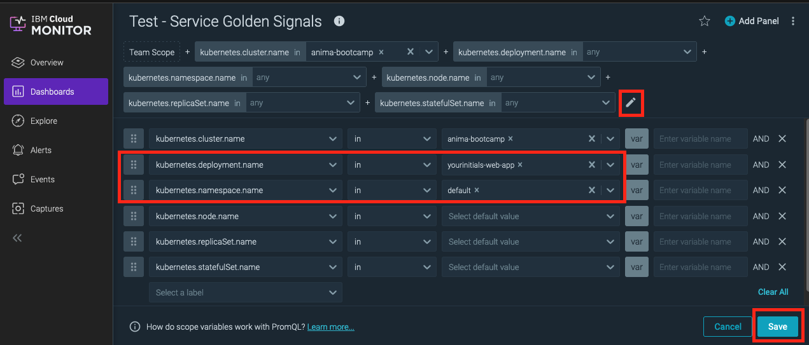
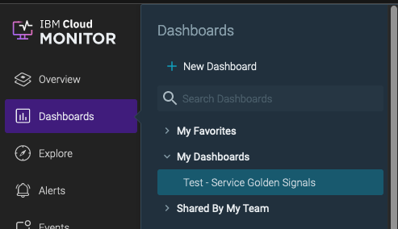
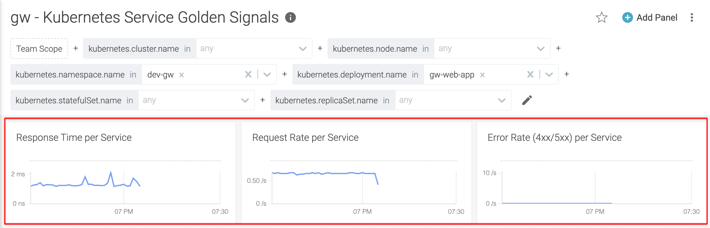
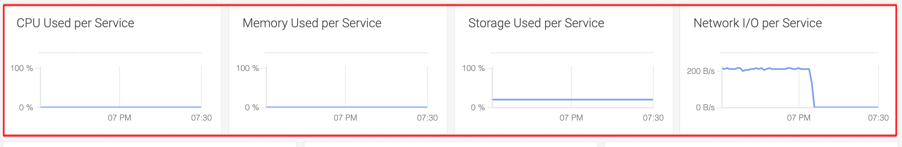

# Lab: Using Sysdig Dashboards

## Prerequisites

- Connected to IBM Kubernetes cluster with attached Sysdig agent
- Make sure everytime you create resources that you target the right Kubernetes cluster and namespace

```bash
ibmcloud ks cluster config --cluster **kubeclusterid**
kubectl config set-context --current --namespace=dev-**yourinitials**
```

## References (but not needed for this lab)

- <https://cloudnative101.dev/electives/monitoring/sysdig/>
- <https://cloudnative101.dev/electives/monitoring/sysdig/activities/dashboards/>
- <https://cloudnative101.dev/electives/monitoring/sysdig/activities/alerts/>

## Challenges to be solved

### Create test deployment producing load

1. Create the following test deployment along with the service definition in your namespace.

```bash
kubectl create deployment yourinitials-web-app --image=docker.io/kennethreitz/httpbin
kubectl create service clusterip yourinitials-web-app --tcp=8080:80
```

2. Add a port mapping

Create a port mapping to run local curl requests, so that we can produce application metrics data.

```bash
kubectl port-forward service/yourinitials-web-app 8080:8080
```

Bring the port-forwarding kubectl command in the background with pressing **CTRL-Z** and then typing **bg** .

3. Start creating HTTP requests

```bash
while true; do sleep 1; curl http://localhost:8080/status/200 -si | head -1 ; done
```

Be patient, it can take a few minutes until the first metrics data flows into our shared Sysdig instance for the first time.

### Create a custom Sysdig Dashboard (based on Kubernetes Service Golden Signal template)

1. Navigate to the Service Golden Signals default template (Dashboard -> Dashboard Templates -> Kubernetes)
   

2. Create a new Custom Dashboard based on this template called "yourinitials - Kubernetes Service Golden Signals" .
   

3. Scope it down to your namespace dev-yourinitials and your deployment yourinitials-web-app.
   

4. In Dashboards -> My Dashboards you will find your created dashboard.
   

## Verification

You should see data with regards to the four golden signals for your deployment:

**Latency** (Response Time per Service), **Traffic** (Request Rate per Service), **Errors** (Error Rate per Service).



Finally **Saturation** (CPU, Memory, Storage, Networking).

